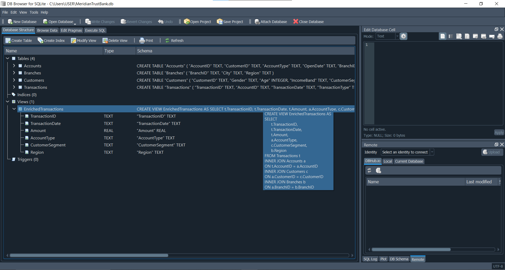

Retail Banking Transaction Analysis – Meridian Trust Bank (Nigeria)

📊 Project Summary

This project analyzes retail banking transaction data using a structured workflow across Excel, SQL, and Power BI.

The objective was to integrate multi-table banking data, perform structured SQL analysis, and present insights through an executive-level dashboard.

Project Objective

Analyze retail banking transactions to identify high-value regions and customer segments, understand monthly transaction trends, and provide actionable insights for revenue growth and customer engagement strategies.

⸻

Dataset Overview
	•	Customers table: Customer ID, Name, Segment
	•	Accounts table: Account ID, Customer ID, Account Type, Branch ID
	•	Transactions table: Transaction ID, Account ID, Date, Amount
	•	Branches table: Branch ID, Region

Data was cleaned and interpreted in Excel and imported into SQLite for relational analysis.

⸻

Data Preparation
	•	INNER JOIN operations were implemented to create a consolidated analytical view combining transactions, accounts, customers, and branch information: EnrichedTransactions
	•	SQL queries were used to aggregate and summarize transactions by region, customer segment, and month.

⸻

Data Preparation & Enrichment

Initial data integration was performed in Excel using VLOOKUP to combine relevant information across transaction-related tables.

Pivot Tables were then created to validate totals and explore early trends.

To optimize performance and ensure scalable analysis, the integrated structure was later recreated in SQL by generating an EnrichedTransactions view, consolidating customer, account, and branch information into a single analytical dataset.

This unified dataset served as the foundation for all subsequent SQL analysis and dashboard development.
### SQL View Creation

Below is the `EnrichedTransactions` view used to consolidate transaction, customer, account, and branch data into a unified analytical dataset:

📊 Analysis 1 — Transaction Value by Region

Business Question:
Which region generates the highest total transaction value?
SELECT 
    Region,
    SUM(Amount) AS TotalTransactionValue
FROM EnrichedTransactions
GROUP BY Region
ORDER BY TotalTransactionValue DESC;

Result Summary:
Region                        Total Transaction Value
South West                 3,450,489,304.11
South South                1,563,122,186.26
North West                 1,506,504,602.60
North Central              1,503,775,266.75
South East                   991,876,714.65

Analytical Insight:
South West dominates total transaction value, indicating strong banking activity and high customer engagement. South South, North West, and North Central are balanced, while South East shows lower activity.

Business Interpretation:
Focus on sustaining service quality in South West; increase engagement and product adoption in South East to boost transaction activity.

⸻

📊 Analysis 2 — Transaction Value by Customer Segment

Business Question:
Which customer segment contributes the highest total transaction value?

SQL Query:
SELECT 
    CustomerSegment,
    SUM(Amount) AS TotalTransactionValue
FROM EnrichedTransactions
GROUP BY CustomerSegment
ORDER BY TotalTransactionValue DESC;

Result Summary:
Customer Segment     Total Transaction Value
Mass                 4,406,499,855.07
Emerging Affluent    3,292,753,433.52
Affluent             1,316,514,785.77

Analytical Insight:
The Mass segment drives the largest volume of transactions, while Emerging Affluent is growing in contribution. Affluent customers generate fewer but potentially higher-value transactions.

Business Interpretation:
	•	Maintain accessibility and service for Mass customers.
	•	Target Emerging Affluent for premium products.
	•	Offer high-margin products and loyalty programs to Affluent customers.

⸻

📊 Analysis 3 — Monthly Transaction Trend

Business Question:
How does total transaction value evolve over time?

Data Source:
Monthly totals calculated from Excel Pivot Tables.
Transaction Month     Total Transaction Value
Jan-2022                260,228,489.80
Feb-2022                223,173,899.10
Mar-2022                247,668,592.00
Apr-2022                245,566,988.50
May-2022                256,013,806.50
Jun-2022                256,921,560.70
Jul-2022                251,656,842.30
Aug-2022                260,509,258.60
Sep-2022                241,468,078.10
Oct-2022                261,064,221.20
Nov-2022                249,592,554.80
Dec-2022                250,076,323.00
Jan-2023                254,768,465.80
Feb-2023                225,466,174.40
Mar-2023                259,794,038.10
Apr-2023                245,566,988.50
May-2023                252,391,974.20
Jun-2023                252,151,436.60
Jul-2023                258,942,281.10
Aug-2023                249,809,830.60
Sep-2023                240,778,318.90
Oct-2023                247,724,142.40
Nov-2023                250,028,863.20
Dec-2023                256,537,353.80
Jan-2024                249,735,297.20
Feb-2024                236,890,473.00
Mar-2024                257,034,007.10
Apr-2024                254,174,630.10
May-2024                259,823,982.50
Jun-2024                248,859,055.00
Jul-2024                254,981,703.40
Aug-2024                249,192,132.40
Sep-2024                247,211,968.60
Oct-2024                254,992,699.50
Nov-2024                245,840,882.10
Dec-2024                252,318,667.40

Analytical Insight:
Transaction activity is consistent across months, with minor peaks suggesting seasonal patterns or campaign effects.

Business Interpretation:
	•	Align marketing campaigns with peak months.
	•	Target low-activity months with promotions to maintain revenue flow.
	•	Use trends for planning staffing, cash flow, and product campaigns.

⸻

Business Recommendations
	1.	Focus engagement and product offerings in high-value regions (South West).
	2.	Tailor campaigns for Emerging Affluent to increase premium adoption.
	3.	Maintain accessibility for Mass customers, the main volume drivers.
	4.	Plan promotions and marketing around monthly trends to optimize transaction activity.
	5.	Consider seasonal adjustments in staffing and product launches based on transaction peaks and troughs.

⸻

Tools Used
	•	Excel: Data cleaning, pivot tables, preliminary analysis
	•	SQLite: View creation, relational data modeling and aggregation queries
	•	Power BI: Dashboard visualizations

  A. Jeremiah Martins |
  Junior Data Analyst
